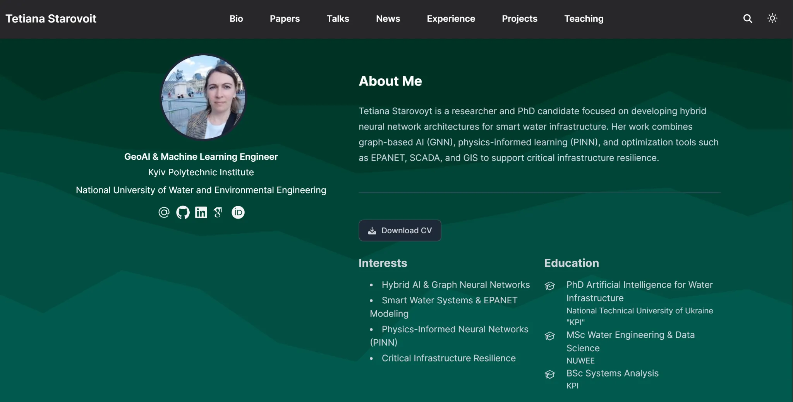

# Tetiana Starovoyt — AI Researcher | GeoAI & Smart Water Systems

Welcome to my academic and professional portfolio!  
I specialize in hybrid artificial intelligence for resilient water infrastructure and environmental monitoring.

## Research Topics
- Hybrid AI: Graph Neural Networks (GNN) + Physics-Informed Neural Networks (PINN)
- SCADA-driven anomaly detection in water networks
- Digital Twins for urban infrastructure
- GIS-based optimization and simulation

## CV
[Download CV](uploads/tetiana-starovoyt-cv.pdf)

## Links
- [LinkedIn](https://www.linkedin.com/in/tetiana-starovoit-61b246200/)
- [GitHub](https://github.com/Tania526-sudo)
- [Google Scholar](https://scholar.google.com/citations?user=moT4uP0AAAAJ&hl=uk)
- [ORCID](https://orcid.org/0009-0008-6335-7679)
